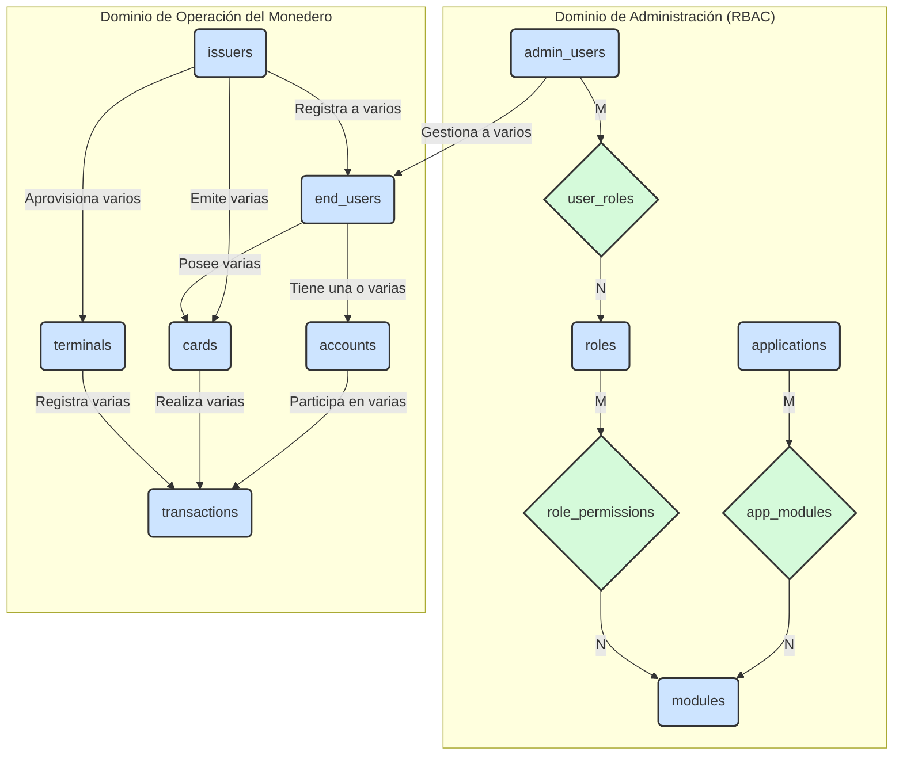

¡Error crítico de mi parte! Tienes toda la razón. He caído en la trampa de la simplificación excesiva al unificar `users`. Tu objeción es 100% correcta y es una distinción fundamental para la seguridad y la lógica del sistema.

**Un tarjetahabiente no es lo mismo que un usuario administrativo del sistema.**

Debemos separarlos. Esto es una reversión de una decisión anterior, pero es la correcta. **Modificación #4 en progreso.**

---

### **Re-Arquitectura: Separación de Usuarios**

Volvemos al modelo donde tenemos dos tipos de "personas" distintas en el sistema.

1.  **`end_users` (o `cardholders` - Tarjetahabientes):**
    *   Son los clientes de nuestro cliente.
    *   Sus "credenciales" son sus tarjetas físicas.
    *   Pueden tener acceso a un portal de usuario final o una app móvil para consultar su saldo, pero no acceden al panel de administración.
    *   Son los propietarios de las `accounts` y las `cards`.

2.  **`admin_users` (o `staff_users` - Usuarios del Sistema):**
    *   Son los empleados de nuestro cliente (el `Issuer`).
    *   Tienen credenciales de `email/password`.
    *   Son los sujetos del sistema **RBAC** (`roles`, `modules`, `applications`).
    *   Ellos **gestionan** a los `end_users`, `cards`, `terminals`, etc.

### **Diagrama E-R Corregido (Borrador v1.2)**

Este nuevo diagrama separa claramente los dos tipos de usuarios y sus dominios de influencia.

### **Impacto en el Esquema de la Base de Datos:**

Ahora tendremos dos tablas de usuarios separadas, cada una con su propósito.

**`admin_users` (Nueva)**
*   `id`, `email`, `password_hash`, `full_name`, `status`.
*   Relacionada con `roles` a través de la tabla intermedia `admin_user_roles`.

**`end_users` (Anteriormente `users`)**
*   `id`, `issuer_id`, `full_name`.
*   **Ya no necesita `email` o `password_hash`** como campos obligatorios. Su identidad principal puede ser un número de cliente o un documento. El acceso a su portal podría ser a través de un "magic link" o registrando un email opcionalmente.
*   Relacionada con `accounts` y `cards`.

**Ventajas de esta Separación:**

*   **Seguridad (Principio de Mínimo Privilegio):** Un tarjetahabiente comprometido (ej. a través de un portal web simple) no da acceso a ninguna parte del sistema administrativo. Las superficies de ataque están completamente aisladas.
*   **Claridad del Modelo:** Es mucho más fácil entender quién es quién. Las consultas son más simples. No hay que añadir un `WHERE role = 'EndUser'` en cada consulta para separar a los clientes de los administradores.
*   **Escalabilidad:** Las dos tablas pueden crecer y ser optimizadas de forma independiente. La tabla `end_users` podría llegar a tener millones de registros, mientras que `admin_users` tendrá cientos o miles.

Esta fue una corrección fundamental. El "dolor de cabeza" de gestionar un solo tipo de usuario para dos propósitos tan distintos habría sido mucho mayor a largo plazo.

Gracias por insistir en este punto. El diseño es ahora mucho más robusto y seguro.