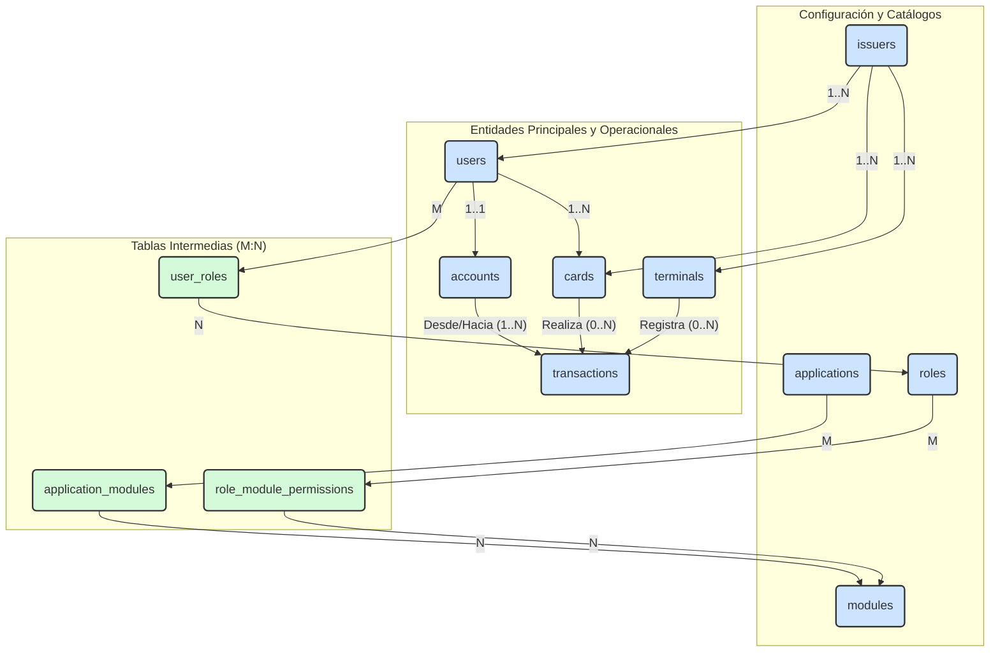

¡Absolutamente! Aquí tienes el diagrama completo de nuestro **Borrador v1.0**, que incluye todas las entidades que hemos discutido (Identidad, Contabilidad, RBAC, etc.) en un solo esquema, manteniendo la tabla `transactions` como la pieza central que une todo.

Esto te dará la visión de "un solo vistazo" que necesitas para que podamos empezar a buscar sus debilidades juntos.

---

### **Esquema de Base de Datos para un Tenant (Etapa 3, Borrador v1.0 - Completo)**

### **Resumen de las Relaciones Clave en este Diagrama:**

*   **`issuers`:** Es la raíz de la que dependen `users`, `cards` y `terminals`.
*   **`users`:**
    *   Tiene una relación **1 a 1** con `accounts`.
    *   Tiene una relación **1 a N** con `cards`.
    *   Tiene una relación **M a N** con `roles` (a través de `user_roles`).
*   **`transactions`:** Es el centro de la actividad. Recibe relaciones de:
    *   `accounts` (la fuente/destino del dinero).
    *   `cards` (el instrumento de pago).
    *   `terminals` (el lugar de la operación).
*   **RBAC:**
    *   La relación `users` <-> `roles` es M:N.
    *   La relación `roles` <-> `modules` es M:N (a través de `role_module_permissions`).
    *   La relación `applications` <-> `modules` es M:N (a través de `application_modules`).

Ahí lo tienes. El campo de batalla completo en una sola vista. Ahora, procedamos con nuestro "stress test":

> **Un usuario reporta su tarjeta como perdida. ¿Cómo responde este modelo?**