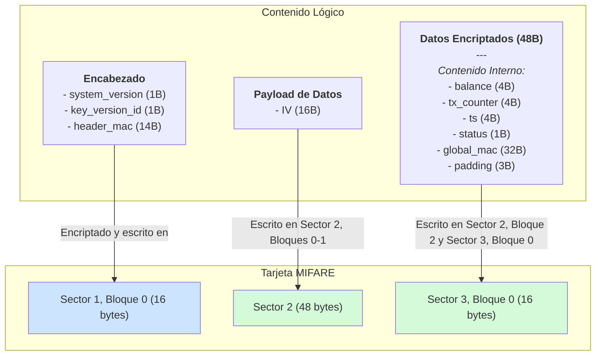

¡Claro que sí! Crear un mapa de memoria claro y detallado es fundamental para la implementación.

Aquí te presento una estructura visual del mapa de la tarjeta, desglosando cada bloque y cada campo con sus respectivos tamaños en bytes. Esto sigue nuestra arquitectura de "doble envoltura".

---

### Mapa General de la Tarjeta MIFARE 1K

| Ubicación | Contenido | Tamaño | Seguridad |
| :--- | :--- | :--- | :--- |
| **Sector 1, Bloque 0** | **Bloque de Encabezado** | 16 Bytes | Encriptado con `Header_Key` |
| **Sector 2, Bloques 0-2**   **Sector 3, Bloque 0** | **Payload de Datos** | 64 Bytes | Encriptado con `Data_Key` |
| _Resto de Sectores_ | _Disponibles o sin usar_ | - | - |

---

### 1. Detalle del Bloque de Encabezado (16 Bytes)

Este bloque es autocontenido y se ubica en una posición fija (ej. Sector 1, Bloque 0).

| Offset (Byte) | Tamaño (Bytes) | Campo | Descripción |
| :--- | :--- | :--- | :--- |
| **0** | 1 | `system_version` | Versión de la estructura de datos y reglas (ej. 1). |
| **1** | 1 | `key_version_id` | ID de la Clave Maestra a usar para derivar `Data_Key`. |
| **2 - 15** | 14 | `header_mac` | MAC truncado (HMAC-SHA256) que protege la integridad de los 2 bytes anteriores. |
| **Total** | **16 Bytes** | | **Encaja perfectamente en 1 bloque MIFARE.** |

---

### 2. Detalle del Payload de Datos (Total: 64 Bytes)

Este payload ocupa 4 bloques MIFARE (4 x 16 = 64 bytes). Comienza en una ubicación fija (ej. Sector 2, Bloque 0).

**Estructura en la Tarjeta:**

| Offset (Byte) | Tamaño (Bytes) | Campo | Descripción |
| :--- | :--- | :--- | :--- |
| **0 - 15** | 16 | **IV (Vector de Inicialización)** | Número aleatorio/único para el cifrado AES-CBC. **No está encriptado.** |
| **16 - 63** | 48 | **Datos Encriptados** | Contenido del monedero, encriptado con `Data_Key`. |
| **Total** | **64 Bytes** | | **Ocupa 4 bloques MIFARE.** |

 

**Contenido Lógico de los "Datos Encriptados" (Antes de Encriptar - Total 48 Bytes)**

Esta es la estructura que tu aplicación maneja en memoria antes de pasarla al motor AES para encriptarla.

| Offset (Byte) | Tamaño (Bytes) | Campo | Formato / Descripción |
| :--- | :--- | :--- | :--- |
| **0 - 3** | 4 | `balance` | Entero 32-bit, sin signo, Big-Endian. (Saldo en céntimos). |
| **4 - 7** | 4 | `tx_counter` | Entero 32-bit, sin signo, Big-Endian. (Contador incremental). |
| **8 - 11** | 4 | `last_tx_ts` | Entero 32-bit, sin signo, Big-Endian. (Timestamp de Unix). |
| **12** | 1 | `card_status` | Entero 8-bit. (1: Activa, 2: Bloqueada, etc.). |
| **13 - 44** | 32 | `global_mac` | **HMAC-SHA256**. Protege la integridad de los campos anteriores (bytes 0-12). |
| **45 - 47** | 3 | `padding` | Relleno añadido por el algoritmo PKCS#7 para alinear a un bloque de 16 bytes. |
| **Total** | **48 Bytes** | | **El resultado encriptado ocupa 3 bloques MIFARE.** |

---

### Resumen Visual y Lógico

*Nota sobre el diagrama: La distribución exacta del Payload de Datos (IV + Encriptado) en los bloques B y C es secuencial. El IV ocuparía el primer bloque (S2B0), y los Datos Encriptados los tres siguientes (S2B1, S2B2, S3B0).*

Este mapa te proporciona una guía exacta, byte por byte, para la implementación tanto en el lado del servidor/Delphi como en el firmware del terminal IoT.