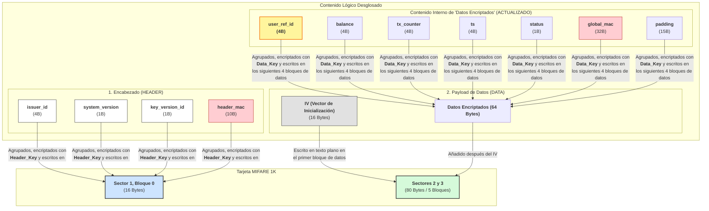

¡Absolutamente! Pido disculpas por el error de formato anterior. Aquí tienes la versión corregida y bien formateada de la documentación final del mapa de memoria, con el `user_ref_id` optimizado a 4 bytes.

---

### Mapa de Memoria Detallado (Versión Optimizada Final)

#### 1. Bloque de Encabezado (HEADER) - 16 Bytes (Sin Cambios)

*   **Ubicación Fija:** Ej. Sector 1, Bloque 0
*   **Seguridad:** Encriptado con `Header_Key` (derivada rápidamente vía AES)

| Offset | Tamaño | Campo | Descripción |
| :--- | :--- | :--- | :--- |
| **0 - 3** | 4 B | `issuer_id` | ID de la empresa emisora (para "fallo rápido"). |
| **4** | 1 B | `system_version` | Versión de la estructura de datos. |
| **5** | 1 B | `key_version_id` | ID de la Clave Maestra a usar. |
| **6 - 15** | 10 B | `header_mac` | MAC truncado para la integridad del encabezado. |
| **Total** | **16 B** | | |

#### 2. Payload de Datos (DATA) - 80 Bytes en Tarjeta (Estructura Interna Optimizada)

*   **Ubicación Fija:** Ej. Comienza en Sector 2, Bloque 0
*   **Seguridad:** IV en texto plano + Datos encriptados con `Data_Key` (derivada de la `Master_Key`).

**Contenido Lógico de los "Datos Encriptados" (64 Bytes antes de encriptar):**

| Offset Lógico | Tamaño | Campo | Descripción |
| :--- | :--- | :--- | :--- |
| **0 - 3** | **4 B** | **`user_ref_id`** | **ID del usuario (entero 32-bit, Big-Endian).** |
| **4 - 7** | 4 B | `balance` | Saldo actual (entero 32-bit, Big-Endian). |
| **8 - 11** | 4 B | `tx_counter` | Contador de transacciones (entero 32-bit, Big-Endian). |
| **12 - 15** | 4 B | `last_tx_ts` | Timestamp de la última transacción (Unix 32-bit). |
| **16** | 1 B | `card_status` | Estado de la tarjeta (Activa, Bloqueada, etc.). |
| **17 - 48** | 32 B | `global_mac` | HMAC-SHA256 para la integridad de los datos (bytes 0-16). |
| **49 - 63** | 15 B | `padding` | Relleno PKCS#7 para alinear a 64 bytes. |
| **Total** | **64 B** | | |

---

### Resumen Lógico y Gráfico del Mapa de Tarjeta (Versión Optimizada Final)

**Explicación de los Cambios en el Diagrama:**

1.  **Encabezado (HEADER):** Permanece **idéntico**. La lógica de control no ha cambiado.
2.  **Payload de Datos (DATA):**
    *   **IV y Datos Encriptados:** La estructura general se mantiene, pero el contenido interno ha sido optimizado.
    *   **`user_ref_id`:** Ahora se muestra claramente con un tamaño de **4 Bytes** (resaltado en amarillo y con borde grueso).
    *   **`padding`:** Como resultado, el padding ha aumentado a 15 bytes para seguir llenando un total de 64 bytes.
    *   **`global_mac`:** Su función es la misma, pero ahora protege un subconjunto de datos ligeramente más pequeño (17 bytes en lugar de 21).

Este documento ahora refleja la decisión de diseño más reciente y eficiente, manteniendo toda la estructura de seguridad intacta y en un formato claro.

¡Excelente pregunta! Es fundamental tener claro el "presupuesto" de espacio que estamos utilizando en la tarjeta.

Aquí está el desglose exacto:

**En total, se han usado 96 bytes, que ocupan 6 bloques de datos MIFARE.**

---

### Desglose Detallado

| Componente | Descripción | Bytes Usados | Bloques MIFARE Usados |
| :--- | :--- | :--- | :--- |
| **Bloque de Encabezado (HEADER)** | `issuer_id`, `versions`, `header_mac` | 16 Bytes | 1 Bloque |
| **Payload de Datos (DATA)** | Compuesto por el IV y los datos encriptados | 80 Bytes | 5 Bloques |
| | _- IV (Vector de Inicialización)_ | _(16 Bytes)_ | _(1 Bloque)_ |
| | _- Datos Encriptados_ | _(64 Bytes)_ | _(4 Bloques)_ |
| **TOTAL** | **Suma de todos los componentes** | **96 Bytes** | **6 Bloques** |

 

**Consideraciones:**

Una tarjeta MIFARE Classic 1K tiene 16 sectores, y cada sector (excepto el 0) tiene 3 bloques de datos disponibles (48 bytes por sector).

*   **Total de bloques de datos disponibles:** Aproximadamente 48 bloques (dependiendo de cómo se use el sector 0).
*   **Bloques usados por nuestro diseño:** 6 bloques.

**Conclusión:** Nuestro diseño es extremadamente eficiente en cuanto a espacio, utilizando solo una pequeña fracción de la capacidad total de la tarjeta. Esto te deja una enorme cantidad de espacio libre para futuras funcionalidades si alguna vez las necesitaras, como por ejemplo:

*   Almacenar un log de las últimas transacciones directamente en la tarjeta.
*   Añadir un segundo monedero (ej. puntos de lealtad).
*   Guardar otro tipo de credenciales.