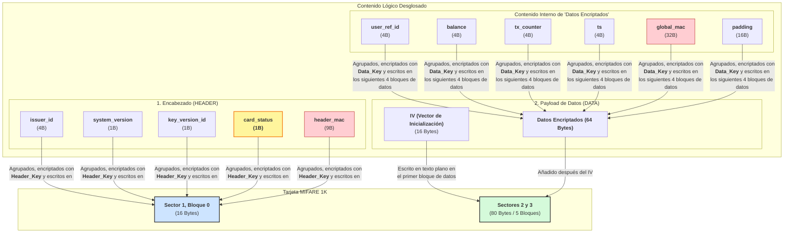

¡Perfecto! Aquí tienes el documento final y consolidado para tus notas. Incluye el mapa de memoria definitivo, el desglose detallado del uso de bytes y bloques, y el diagrama lógico actualizado con el `card_status` en el encabezado.

---

### Documentación Final del Mapa de Tarjeta (Versión 1.0)

#### 1. Resumen de Uso de Espacio en Tarjeta MIFARE 1K

| Componente | Descripción | Bytes Usados | Bloques MIFARE Usados |
| :--- | :--- | :--- | :--- |
| **Bloque de Encabezado (HEADER)** | Metadatos de control y estado. | 16 Bytes | 1 Bloque |
| **Payload de Datos (DATA)** | Compuesto por el IV y los datos de la cartera. | 80 Bytes | 5 Bloques |
| | _- IV (Vector de Inicialización)_ | _(16 Bytes)_ | _(1 Bloque)_ |
| | _- Datos Encriptados_ | _(64 Bytes)_ | _(4 Bloques)_ |
| **TOTAL** | **Suma de todos los componentes** | **96 Bytes** | **6 Bloques** |

**Conclusión de uso:** El diseño utiliza solo 6 de los ~48 bloques de datos disponibles, dejando un amplio espacio para futuras expansiones.

---

#### 2. Mapa de Memoria Detallado

##### 2.1. Bloque de Encabezado (HEADER) - 16 Bytes

Este bloque permite un "fallo rápido" para rechazar tarjetas no válidas o bloqueadas con un rendimiento máximo.

*   **Ubicación Fija:** Ej. Sector 1, Bloque 0
*   **Seguridad:** Encriptado con `Header_Key` (derivada rápidamente vía AES)

| Offset | Tamaño | Campo | Descripción |
| :--- | :--- | :--- | :--- |
| **0 - 3** | 4 B | `issuer_id` | ID de la empresa emisora. |
| **4** | 1 B | `system_version` | Versión de la estructura de datos. |
| **5** | 1 B | `key_version_id` | ID de la Clave Maestra a usar. |
| **6** | **1 B** | **`card_status`** | **Estado de la tarjeta (1: Activa, 2: Bloqueada, etc.).** |
| **7 - 15** | **9 B** | `header_mac` | MAC truncado que protege la integridad de los 7 bytes anteriores. |
| **Total** | **16 B** | | |

##### 2.2. Payload de Datos (DATA) - 80 Bytes en Tarjeta

Contiene la información sensible de la cartera del usuario.

*   **Ubicación Fija:** Ej. Comienza en Sector 2, Bloque 0
*   **Seguridad:** IV en texto plano + Datos encriptados con `Data_Key` (derivada de la `Master_Key`).

**Contenido Lógico de los "Datos Encriptados" (64 Bytes antes de encriptar):**

| Offset Lógico | Tamaño | Campo | Descripción |
| :--- | :--- | :--- | :--- |
| **0 - 3** | 4 B | `user_ref_id` | ID del usuario (entero 32-bit, Big-Endian). |
| **4 - 7** | 4 B | `balance` | Saldo actual (entero 32-bit, Big-Endian). |
| **8 - 11** | 4 B | `tx_counter` | Contador de transacciones (entero 32-bit, Big-Endian). |
| **12 - 15** | 4 B | `last_tx_ts` | Timestamp de la última transacción (Unix 32-bit). |
| **16 - 47** | 32 B | `global_mac` | HMAC-SHA256 para la integridad de los datos (bytes 0-15). |
| **48 - 63** | 16 B | `padding` | Relleno PKCS#7 para alinear el total a 64 bytes. |
| **Total** | **64 B** | | |

---

#### 3. Resumen Lógico y Gráfico del Mapa de Tarjeta

