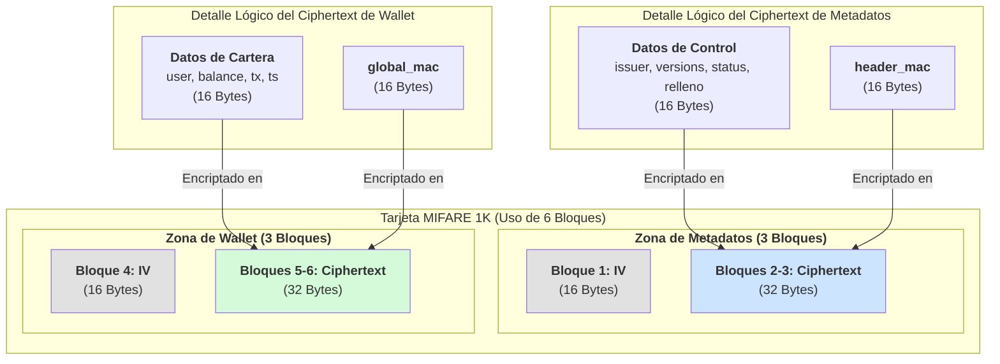

¡Por supuesto! Aquí tienes la documentación final y pulida del mapa de la tarjeta, en un formato claro y resumido, perfecto para tus notas de proyecto. Este documento refleja nuestro diseño final de "Paquetes Separados".

---

### Documentación Final del Mapa de Tarjeta (Arquitectura de Paquetes Separados)

#### 1. Resumen General y Uso de Espacio

Este diseño utiliza dos zonas de datos independientes y encriptadas, una para los metadatos de control y otra para la cartera del usuario.

*   **Zona de Metadatos:** 3 bloques (48 bytes)
*   **Zona de Wallet:** 3 bloques (48 bytes)
*   **Total Usado:** **6 bloques (96 bytes)** de la capacidad de la tarjeta.

---

#### 2. Detalle de la Zona de Metadatos (3 Bloques)

*   **Propósito:** Contiene información de control para permitir un rechazo rápido ("fail-fast") de tarjetas no válidas o bloqueadas.
*   **Ubicación Sugerida:** Sector 1, Bloques 0-2.
*   **Seguridad:** Encriptado con una clave `Header_Key` (derivada de una clave fija del sistema + UID).

| Bloque Físico | Contenido | Tamaño | Descripción |
| :--- | :--- | :--- | :--- |
| **Bloque 0** | **IV para Metadatos** | 16 Bytes | Vector de Inicialización público y único por cada escritura. |
| **Bloques 1-2** | **Ciphertext de Metadatos** | 32 Bytes | El payload de metadatos encriptado. |

**Contenido Lógico del "Ciphertext de Metadatos" (antes de encriptar):**

| Offset Lógico | Tamaño | Campo | Descripción |
| :--- | :--- | :--- | :--- |
| **0 - 3** | 4 B | `issuer_id` | ID de la empresa emisora. |
| **4** | 1 B | `system_version` | Versión de la estructura de datos. |
| **5** | 1 B | `key_version_id` | ID de la Clave Maestra a usar para la wallet. |
| **6** | 1 B | `card_status` | Estado de la tarjeta (Activa, Bloqueada, etc.). |
| **7 - 15** | 9 B | Relleno Interno | Relleno con ceros para alinear a 16 bytes. |
| **16 - 31** | 16 B | **`header_mac`** | HMAC-SHA256 truncado a 128 bits para proteger los 16 bytes anteriores. |
| **Total** | **32 B** | | |

---

#### 3. Detalle de la Zona de Wallet (3 Bloques)

*   **Propósito:** Contiene los datos financieros y transaccionales del usuario.
*   **Ubicación Sugerida:** Sector 2, Bloques 0-2.
*   **Seguridad:** Encriptado con una `Data_Key` (derivada de la `Master_Key` secreta + UID).

| Bloque Físico | Contenido | Tamaño | Descripción |
| :--- | :--- | :--- | :--- |
| **Bloque 0** | **IV para Wallet** | 16 Bytes | Vector de Inicialización público y único por cada escritura. |
| **Bloques 1-2** | **Ciphertext de Wallet** | 32 Bytes | El payload de la cartera encriptado. |

**Contenido Lógico del "Ciphertext de Wallet" (antes de encriptar):**

| Offset Lógico | Tamaño | Campo | Descripción |
| :--- | :--- | :--- | :--- |
| **0 - 3** | 4 B | `user_ref_id` | ID del usuario (entero 32-bit, Big-Endian). |
| **4 - 7** | 4 B | `balance` | Saldo actual (entero 32-bit, Big-Endian). |
| **8 - 11** | 4 B | `tx_counter` | Contador de transacciones (entero 32-bit, Big-Endian). |
| **12 - 15** | 4 B | `last_tx_ts` | Timestamp de la última transacción (Unix 32-bit). |
| **16 - 31** | 16 B | **`global_mac`** | HMAC-SHA256 truncado a 128 bits para proteger los 16 bytes anteriores. |
| **Total** | **32 B** | | |

---

#### 4. Diagrama Lógico Visual

