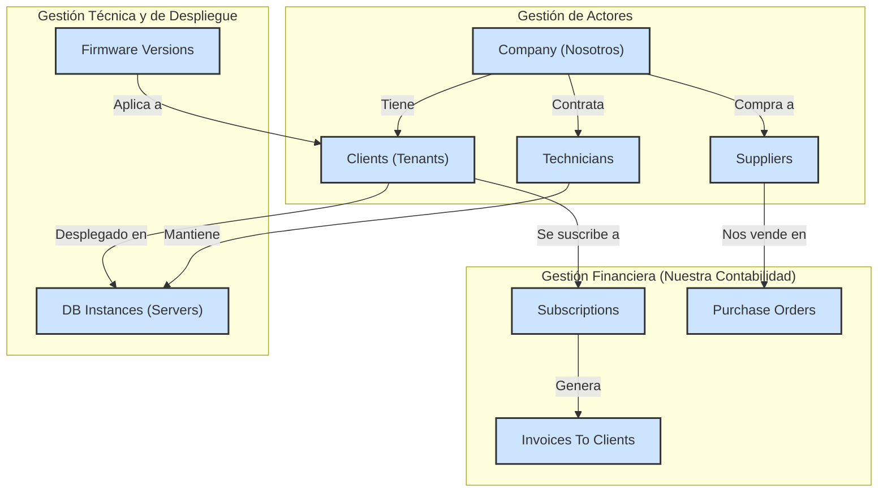

¡Mi error de nuevo! Tienes toda la razón, la sintaxis de Mermaid que usé para el salto de línea y el subíndice (` ` y ``) no es válida dentro de la definición de un nodo de esa manera. Estaba intentando ser demasiado descriptivo y rompí el diagrama.

Pido disculpas por el plano defectuoso. Aquí está la versión corregida del diagrama, con nombres más simples y sintaxis válida, que representa la misma estructura lógica.

---
### **Diseño de la Base de Datos de Gestión del SaaS (Nuestra DB) - Diagrama Corregido**

**Correcciones Realizadas:**

1.  **Nombres de Nodos:** Simplifiqué los nombres dentro de los nodos para que sean texto plano entre comillas, eliminando las etiquetas HTML que causaban el error de parseo (`C(Company ...)` se convirtió en `C["Company (Nosotros)"]`).
2.  **Claridad:** El diagrama ahora es sintácticamente correcto y debería renderizarse sin problemas, manteniendo la misma estructura lógica de entidades y relaciones que discutimos.

Gracias por la atenta supervisión. Ahora, con esta estructura para **nuestra propia DB** aclarada, podemos volver a poner toda nuestra atención en encontrar las debilidades del **esquema de la DB del Tenant**.